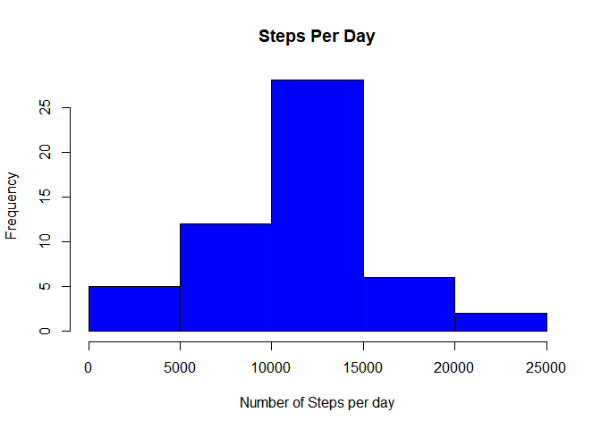
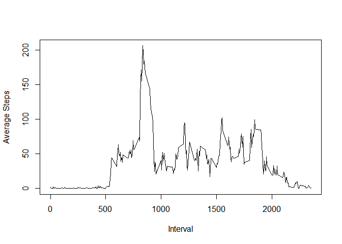
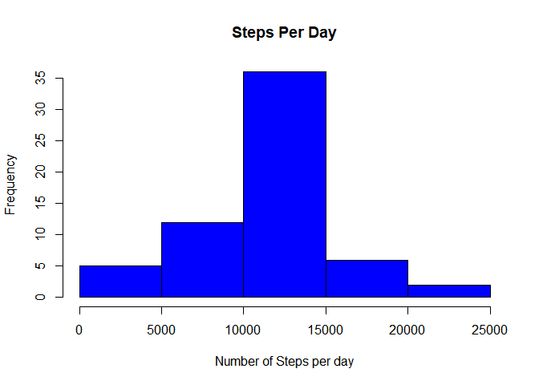
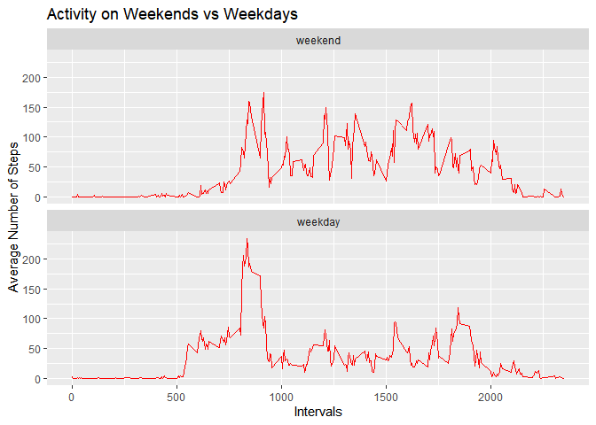

## Loading and preprocessing the data


```r
        library(dplyr)
```

```
## 
## Attaching package: 'dplyr'
```

```
## The following objects are masked from 'package:stats':
## 
##     filter, lag
```

```
## The following objects are masked from 'package:base':
## 
##     intersect, setdiff, setequal, union
```

```r
        library(ggplot2)
        activity_data <- read.csv("activity.csv", header=T, sep=',', na.strings="?", 
                                   nrows=17568, check.names=F, stringsAsFactors=F, comment.char="", quote='\"')
        
        activity_data$steps <- as.numeric(activity_data$steps)
```

```
## Warning: NAs introduced by coercion
```

```r
        activity_data$date <- as.Date(activity_data$date, format="%Y-%m-%d")
```


## What is mean total number of steps taken per day?


```r
        activity_steps_day <- aggregate(steps ~ date, data = activity_data, FUN = sum, na.rm = TRUE)
        hist(activity_steps_day$steps, main="Steps Per Day", 
             xlab="Number of Steps per day", ylab="Frequency", col="blue")
```

<!-- -->

```r
        print(paste("Mean of Number of Steps taken per day",mean(activity_steps_day$steps,na.rm = TRUE)))
```

```
## [1] "Mean of Number of Steps taken per day 10766.1886792453"
```

```r
        print(paste("Median of Number of Steps taken per day",median(activity_steps_day$steps,na.rm = TRUE)))
```

```
## [1] "Median of Number of Steps taken per day 10765"
```


## What is the average daily activity pattern?

```r
        activity_steps_interval <- aggregate(steps ~ interval, data = activity_data, FUN = mean, na.rm = TRUE)
        with(activity_steps_interval, {
                plot(activity_steps_interval$steps~activity_steps_interval$interval, type="l",
                     ylab="Average Steps", xlab="Interval")
        })
```

<!-- -->

```r
        max_interval <- which(activity_steps_interval$steps==max(activity_steps_interval$steps))
        print(paste("5-minute interval which contains the maximum number of steps(average)",activity_steps_interval$interval[max_interval],
                    " with ",max(activity_steps_interval$steps)," steps."))
```

```
## [1] "5-minute interval which contains the maximum number of steps(average) 835  with  206.169811320755  steps."
```


## Imputing missing values


```r
        print(paste("Total Number of NA Values in the dataset = ",sum(is.na(activity_data$steps))))
```

```
## [1] "Total Number of NA Values in the dataset =  2304"
```

```r
        activity_steps_interval <- tapply(activity_data$steps, activity_data$interval, mean, na.rm = TRUE)
        missing_data <- activity_data[is.na(activity_data$steps),]
        non_missing_data <- activity_data[!is.na(activity_data$steps),]
        missing_data$steps <- as.factor(missing_data$interval)
        levels(missing_data$steps) <- activity_steps_interval
        levels(missing_data$steps) <- round(as.numeric(levels(missing_data$steps)))
        missing_data$steps <- as.integer(as.vector(missing_data$steps))
        
        combined_data <- rbind(missing_data, non_missing_data)
        
        print(paste("Total Number of NA Values in the new dataset = ",sum(is.na(combined_data$steps))))
```

```
## [1] "Total Number of NA Values in the new dataset =  0"
```

```r
        activity_steps_day <- aggregate(steps ~ date, data = combined_data, FUN = sum, na.rm = TRUE)
        hist(activity_steps_day$steps, main="Steps Per Day", 
             xlab="Number of Steps per day", ylab="Frequency", col="blue")
```

<!-- -->

```r
        print(paste("Mean of Number of Steps taken per day",mean(activity_steps_day$steps,na.rm = TRUE)))
```

```
## [1] "Mean of Number of Steps taken per day 10765.6393442623"
```

```r
        print(paste("Median of Number of Steps taken per day",median(activity_steps_day$steps,na.rm = TRUE)))
```

```
## [1] "Median of Number of Steps taken per day 10762"
```

## Are there differences in activity patterns between weekdays and weekends?


```r
        weekdays_list <- c('Monday', 'Tuesday', 'Wednesday', 'Thursday', 'Friday')
        activity_data$dayType <- factor((weekdays(activity_data$date) %in% weekdays_list), 
                           levels=c(FALSE, TRUE), labels=c('weekend', 'weekday'))
        activity_steps_day <- aggregate(steps ~ interval + dayType, data = activity_data, FUN = mean, na.rm = TRUE)
        names(activity_steps_day) <- c("interval", "dayType", "mean_steps")
        plot <- ggplot(activity_steps_day, aes(interval, mean_steps))
        plot + geom_line(color = "red") + facet_grid(dayType~.) +facet_wrap(dayType~.,ncol=1,strip.position="top")+ labs(x = "Intervals", y = "Average Number of Steps", title = "Activity on Weekends vs Weekdays")
```

<!-- -->
